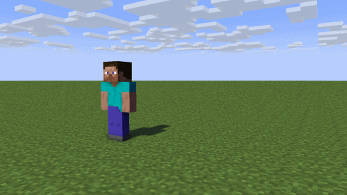

# Mine-imator Keyframe Maker (WIP)

A software to create mine-imator keyframes without actually using the program.

## Demo

It does not have any fancy features at the moment, but here is a demo of what I have made until this time.



The above The above keyframes are generated by these two lines of code:

```csharp
miKeyframes.AddKeyframe(miKeyframes.MakeKeyframe(0, values: new Values(POS_X: 0, POS_Y: 0, POS_Z: 0)));
miKeyframes.AddKeyframe(miKeyframes.MakeKeyframe(24, values: new Values(POS_X: 50, POS_Y: 0, POS_Z: 0, ROT_Z: 50)));
```

Which adds two keyframes; the first one sets the character's position to (0, 0, 0), and the second one sets it to (50, 0, 0) and z-axis rotation to 50˚.

## Roadmap

- Add a feature to convert a video file to frames and make UI for people to pick points from it

- Maybe add motion capture?

## License

[GNU GPLv3](https://choosealicense.com/licenses/gpl-3.0/)
