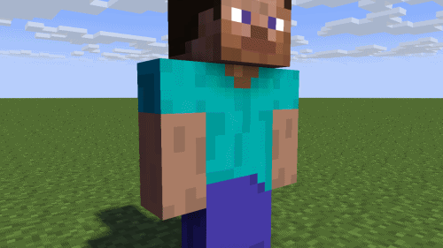

# Mine-imator Keyframe Maker (WIP)

A software to create [Mine-imator](https://github.com/stuffbydavid/Mine-imator) keyframes without actually using the program.

## Demo

It does not have any fancy features at the moment, but here is a demo of what I have made until this time.



The above keyframes are generated by these two lines of code:

```csharp
mikf.Add(0, right_arm);
mikf.Add(24, right_arm, new Values(ROT_X: 30, BEND_ANGLE_X: 30));
```

Which make the character rotate its arm 30˚ while bending it 30˚.

## Roadmap

- Add a feature to convert a video file to frames and make UI for people to pick points from it

- Maybe add motion capture?

## Demos from Outdated Releases

### 0.1.0


```csharp
miKeyframes.AddKeyframe(miKeyframes.MakeKeyframe(0, values: new Values(POS_X: 0, POS_Y: 0, POS_Z: 0)));
miKeyframes.AddKeyframe(miKeyframes.MakeKeyframe(24, values: new Values(POS_X: 50, POS_Y: 0, POS_Z: 0, ROT_Z: 50)));
```

## License

[GNU GPLv3](https://choosealicense.com/licenses/gpl-3.0/)

## Release Notes
### 0.1.3
* Renamed `MakeAndAddKeyframe` method to `Add`.
* Edited `Add` method so that it gets `Char.Bodypart` enum as the second parameter.

### 0.1.2
* Added `TRANSITION` property in `Values` class.

### 0.1.1
* Added `Char` class.
* Added `Bodypart` enum in `Char` class.
* Added `MakeAndAddKeyframe` method to `MIKeyframes` class.

### 0.1.0
* Created the program.
* Not sure what to write here.
